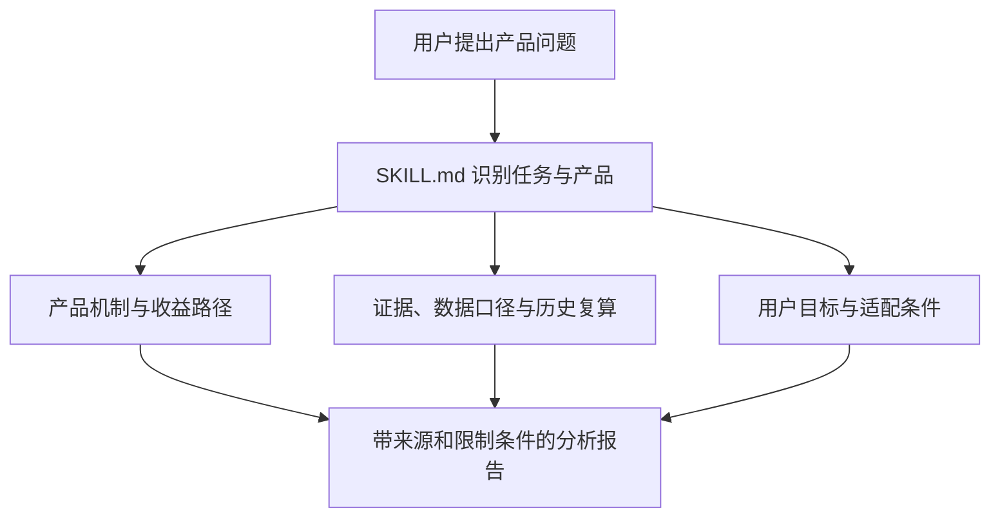

<p align="center">
  
</p>

<h1 align="center">Financial Product Navigator</h1>

<p align="center">
  面向非金融专业用户的金融产品收益与风险分析 Skill
</p>

<p align="center">
  <em>An evidence-oriented AI skill for explaining return sources, risk transmission, historical performance, product costs, and conditional suitability.</em>
</p>

## 项目概述

Financial Product Navigator 是一个可复用的 AI Skill，用来把“这只 ETF 值不值得买”“这个理财产品安全吗”一类模糊问题，转化为结构清晰、能够核验的产品分析。

它不直接预测涨跌，也不承诺收益。项目重点解决的是另一个更基础的问题：**用户实际持有什么、收益最终由谁创造、风险如何一步步变成亏损、历史数据应该怎样计算，以及产品在什么条件下才可能适合某类目标。**

| 项目一览 | 内容 |
| --- | --- |
| 项目形态 | 模块化 AI Skill + Python 历史绩效计算工具 |
| 目标用户 | 希望理解 ETF、基金、存款、债券、保险和结构化产品的非专业投资者 |
| 核心方法 | 产品穿透、收益资金路径、风险因果链、证据核验、统一数据口径和条件化适配 |
| 技术组成 | Markdown、YAML、Python 3.10+、pandas、命令行接口、JSON / Markdown 输出 |
| 当前状态 | 可用原型；核心脚本可运行，自动取数、测试套件和标准化评测仍在规划中 |

该项目同时是一项求职作品，用于展示我在以下领域的综合能力：

- AI Skill 与任务工作流设计；
- 金融产品机制和风险建模；
- 数据口径核验与历史收益复算；
- Python 数据分析与命令行工具开发；
- 面向非专业用户的信息表达；
- 负责任 AI 的约束与适配性设计。

## 为什么需要这个项目

普通的大模型回答金融问题时，容易出现四类问题。

第一，产品身份可能被混淆。例如，指数、跟踪指数的 ETF、投资该 ETF 的联接基金，以及挂钩同一指数的结构化产品，底层名称相似，但费用、汇率、流动性和损失方式并不相同。

第二，收益解释经常停留在“买的人多就上涨”，没有继续追问资金最终对应什么经济现金流。长期股票回报应当连接到企业盈利、分红和估值，而债券、存款、保险和商品又有完全不同的收益来源。

第三，风险容易被写成一串标签。仅仅列出“市场风险、流动性风险、政策风险”并不能帮助用户理解损失如何发生。本 Skill 要求按照“触发事件 → 变量变化 → 现金流或估值变化 → 投资者损失”的路径解释风险。

第四，历史收益可能因为数据口径不同而失真。价格收益、总回报、基金净值和场内成交价不是同一概念；不同币种、不同费率处理和不同时间区间也不能直接比较。

Financial Product Navigator 将这些问题写成明确的分析规则，让 AI 的输出更接近一份可检查的研究过程，而不是一次不可复现的自由发挥。

## 核心能力

### 1. 精确识别产品

分析前先核对产品全称、代码或 ISIN（国际证券识别码）、份额类别、上市地点、交易币种、标的指数、成立日期、分红方式，以及是否包含杠杆、反向或汇率对冲结构。

### 2. 分离底层资产与产品包装

项目把一项金融产品拆成四层：

1. **经济敞口**：真正决定收益的股票、债券、商品、贷款、房地产或衍生品；
2. **基准**：指数或参考利率，本身可能只是一个计算结果；
3. **产品载体**：ETF、基金、QDII、银行理财、保险或结构化票据；
4. **投资者结果**：在费用、税收、跟踪偏离、汇率和折溢价之后，投资者实际获得的回报。

这一步可以避免把“看好某个行业”直接等同于“任何跟踪产品都一样”。

### 3. 追踪收益的资金路径

Skill 使用统一的收益桥梁，再根据具体产品替换其中变量：

```text
投资者收益
≈ 收到的现金收入
+ 资产价值变化
+ 汇率影响
+ 产品结构或期权收益
− 费用
− 税收
− 跟踪与交易摩擦
```

公式的作用不是追求数学复杂度，而是确保回答能够说明每一部分收益来自哪里、在什么条件下会变成负数。

### 4. 把风险写成因果链

每项主要风险都需要回答四个问题：什么事件触发风险、哪个经营或定价变量受到影响、它如何传导到产品净值或成交价，以及投资者最终会损失什么。

项目还会区分普通价格波动与永久资本损失、暂时无法按理想价格卖出与真正无法赎回，以及底层资产下跌与产品包装本身失效。

### 5. 复算历史表现

仓库中的 Python 工具可以根据清洗后的价格、总回报指数或基金净值序列，计算：

- 累计收益率；
- 年化收益率（CAGR，即连接期初与期末的等效年增长率）；
- 年化波动率；
- 最大回撤及其高点、低点和恢复日期；
- 近 1、3、5、10 年滚动区间；
- 分年度收益和样本内最差完整年度。

脚本不会自动抓取行情，也不会替输入数据补做分红复权、汇率转换或费用调整。这样的边界是有意设计的：**计算可以自动化，但数据的经济含义必须先由人或研究流程核验。**

### 6. 输出有条件的适配判断

Skill 不根据年龄、职业或一句“我能承受高风险”直接给出买卖结论。它会检查目标、期限、应急资金、现金流稳定性、可承受损失、流动性、支出币种、已有持仓和产品复杂度，再返回以下四种标签之一：

- `适合`
- `有条件适合`
- `暂不适合`
- `信息不足`

这里的判断是教育和决策辅助，不是监管意义上的适当性认定。

## 工作流程



实际执行时，输入会依次经历以下过程：

1. 判断用户是在了解一个产品、比较多个产品，还是需要个人适配判断；
2. 识别准确产品，并分离底层资产、基准、产品载体和投资者结果；
3. 选择与产品类型匹配的收益来源和风险传导模型；
4. 对费率、持仓、产品条款和时效性数据进行来源核验；
5. 在存在合格历史序列时，用确定性脚本复算收益、波动和回撤；
6. 根据目标、期限和损失承受能力给出条件化结论；
7. 输出行动前仍需检查的文件、数据和产品条款。

## 仓库结构

```text
financial-product-navigator/
├── SKILL.md
├── README.md
├── agents/
│   └── openai.yaml
├── assets/
│   └── icon.svg
├── references/
│   ├── data-methodology.md
│   ├── product-mechanics.md
│   └── suitability-and-output.md
└── scripts/
    └── analyze_returns.py
```

| 文件 | 在系统中的职责 |
| --- | --- |
| [`SKILL.md`](./SKILL.md) | 整个 Skill 的控制层。定义触发场景、不可违反的原则、任务路由和七步分析流程。 |
| [`references/data-methodology.md`](./references/data-methodology.md) | 规定数据来源优先级、收益口径、最大回撤等指标公式，以及多产品公平比较方法。 |
| [`references/product-mechanics.md`](./references/product-mechanics.md) | 提供存款、债券、股票 ETF、QDII、REIT、商品、保险和结构化产品等类别的收益与损失机制地图。 |
| [`references/suitability-and-output.md`](./references/suitability-and-output.md) | 定义用户信息收集、适配判断顺序、完整报告结构和建议边界。 |
| [`scripts/analyze_returns.py`](./scripts/analyze_returns.py) | 使用 pandas 对合格时间序列执行确定性的历史收益、波动率和最大回撤计算，可输出 Markdown 或 JSON。 |
| [`agents/openai.yaml`](./agents/openai.yaml) | 定义 Skill 的展示名称、简介、默认提示词、图标和可调用产品范围。 |
| [`assets/icon.svg`](./assets/icon.svg) | Skill 的界面图标。 |

这种结构体现了“渐进式加载”的设计：主文件负责判断应该做什么，参考文件提供特定领域规则，Python 脚本只负责适合确定性计算的部分。这样比把全部内容塞进一个超长提示词更容易维护、审查和扩展。

## Demo：同样叫“ETF”，分析重点并不相同

下面两个案例说明 Skill 为什么要先识别底层资产和产品包装，而不是套用统一模板。

| 分析对象 | 容易出现的误解 | Skill 需要识别的底层逻辑 | 重点包装层风险 |
| --- | --- | --- | --- |
| 513300 纳斯达克 100 ETF（QDII） | 把它理解成“全部美国科技股”或直接等同于 QQQ | 大型非金融纳斯达克上市公司的盈利、分红和估值，当前可能具有较高科技与成长风格暴露 | 美元兑人民币、跨境交易时差、额度、跟踪偏离和场内折溢价 |
| 561360 中证油气产业 ETF | 把它理解成固定倍数跟踪国际原油价格 | 上游开采、炼化、油服设备、油运和化工公司的盈利与估值；不同环节对油价可能反应相反 | 行业和头部持仓集中、A 股估值、跟踪误差和场内交易摩擦 |

例如，油价上涨可能改善上游开采企业的利润，却同时提高炼化企业的原料成本。因此，“看对油价方向”并不能保证油气产业股票 ETF 获得相同比例的收益。这个区别正是产品机制分析需要解决的问题。

一个适合展示完整能力的示例提示词是：

```text
使用 $financial-product-navigator 分析 561360。

我已经准备了应急资金，希望用一只 ETF 配置油气行业，计划持有三年以上，
可以接受较大波动。请说明它是否等于直接投资原油、收益从哪里来、主要风险
如何传导成亏损、历史最大回撤是多少，并判断它在什么条件下适合我。
```

预期输出不是简单的“可以买”或“风险较高”，而是一份包含产品身份、持仓结构、收益路径、风险链、历史统计口径、压力情景、条件化适配判断和行动前核对项的报告。

## 快速开始

### 方式一：作为 AI Skill 使用

先克隆仓库：

```bash
git clone https://github.com/RyanL0veCode/financial-product-navigator.git
cd financial-product-navigator
```

将整个目录导入支持 Skill 的 AI 环境，并保持 `SKILL.md`、`references/`、`scripts/`、`agents/` 和 `assets/` 的相对路径不变。不同平台的安装位置和导入方式可能不同，应以所使用平台的最新说明为准。

导入后可以从一个具体产品问题开始：

```text
使用 $financial-product-navigator 分析 513300 的收益来源、风险、费用、
历史最大回撤和适用条件。请核验准确产品，并为所有时效性数据标注日期和来源。
```

### 方式二：单独运行历史收益计算器

脚本使用了 `float | None` 等 Python 类型语法，建议使用 Python 3.10 或更高版本，并安装 pandas：

```bash
python --version
python -m pip install pandas
```

准备一份至少包含日期和值两列的 CSV。这里的 `Adj_Close` 表示已经按研究目的处理好的复权价格、总回报指数或可比净值，而不是任意抓取的原始收盘价。

```csv
Date,Adj_Close
2024-01-02,100.00
2024-01-03,100.80
2024-01-04,99.90
```

运行计算：

```bash
python scripts/analyze_returns.py prices.csv \
  --date-column Date \
  --value-column Adj_Close
```

默认输出为 Markdown。若下游程序需要读取结果，可以切换为 JSON：

```bash
python scripts/analyze_returns.py prices.csv \
  --date-column Date \
  --value-column Adj_Close \
  --format json
```

脚本会检查列名、日期、缺失值、重复日期和非正数，并根据观测间隔推断日频、周频、月频或其他频率。数据可以自动排序，重复日期保留最后一条有效记录；少于三个有效观测或时间跨度无效时，脚本会停止并返回错误。

## 数据和计算原则

为了让历史结果能够被复核，项目遵守以下规则：

- 产品身份、费用、持仓、杠杆和赎回条款至少需要一个官方或监管来源；
- 优先使用总回报指数、复权价格或可比基金净值；
- 明确区分价格收益、总回报、净值收益和场内成交价收益；
- 多产品比较应使用共同时间区间、相同币种和一致的收益口径；
- 最大回撤必须同时报告前高日期、低点日期和恢复日期，未恢复时应明确说明；
- 产品成立前的指数记录只能标记为代理历史，不能伪装成真实产品业绩；
- 历史最大回撤不是未来损失上限，仍需要机制化压力情景。

具体规则和公式见 [`data-methodology.md`](./references/data-methodology.md)。

## 这不只是一段 Prompt

从工程角度看，本项目采用了“语言模型负责语义判断，确定性代码负责数值计算”的分工。

语言模型适合识别产品、解释机制、发现信息缺口和组织结论，但不应凭记忆生成当前费率、持仓或历史回撤。Python 脚本则适合处理可重复的时间序列计算，却无法自行判断输入列到底代表复权价格、未复权收盘价还是基金净值。

两者组合后形成互相约束的流程：AI 必须说明输入数据的经济含义，代码负责稳定计算，最终报告还要披露来源、口径和限制。这种设计减少了纯语言模型的数值幻觉，也避免了“代码算对了，但输入含义错了”的问题。

## 当前边界

当前版本有意保持为轻量、可审查的 Skill，因此存在以下边界：

- 不自动连接券商，也不执行交易；
- 不承诺收益，不替代持牌投资、法律或税务建议；
- 不内置行情抓取器，时效性数据需要在运行时从可靠来源核验；
- 历史计算结果完全继承输入序列的质量和经济含义；
- 不会自动完成分红复权、汇率转换、通胀调整、费用或个人税收模拟；
- 当前仓库尚未提供自动化测试套件和标准化示例数据集；
- 因果解释是研究判断，不应仅凭事件与市场下跌发生在相近日期就断言因果关系。

这些限制不是免责声明式的附注，而是决定结果能否被正确解释的重要条件。

## 后续计划

- 增加经过脱敏的示例数据与完整案例报告，形成可复现的端到端 Demo；
- 为收益窗口、重复日期、未恢复回撤和异常输入增加单元测试；
- 增加官方数据源适配层，同时保留来源和原始口径记录；
- 增加基准与基金跟踪偏离的自动比较；
- 增加中英文双语报告模板；
- 建立版本化评测集，检查产品识别、数字引用、风险链和适配结论是否符合规则。

## 项目价值

这个项目希望证明的不是“AI 可以替人推荐基金”，而是：**复杂的金融判断可以被拆成一套有证据、有计算、有边界、可复查的协作流程。**

对于 AI 产品或数据岗位，它展示了任务拆解、模块化 Skill 设计、人机分工和安全约束；对于金融或量化岗位，它展示了产品穿透、收益口径、风险传导、历史绩效测量和适配性分析能力。

## 免责声明

本项目用于教育、研究和作品展示，不构成收益承诺、个性化投资建议或任何产品的买卖推荐。历史表现不代表未来。采取行动前，请核对最新产品文件、数据来源及适用的当地规则。

---

Created by [RyanL0veCode](https://github.com/RyanL0veCode)
